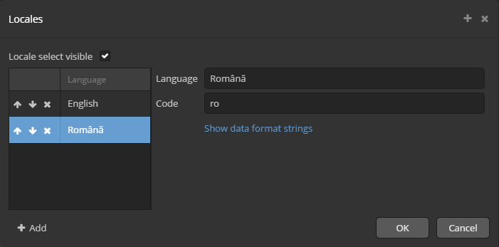

[](http://www.apache.org/licenses/LICENSE-2.0)

# CUBA Romanian Translation Add-on

Romanian translation of CUBA Platform (plus commercial components) implemented as an add-on.

## Installation

**NOTE**: This add-on's repository is officially linked to the main CUBA repository.

*You can jump straight to step 2. for instructions on how to add it to your project*, or *optionally*
you can choose to add my repository to your project's repositories.  

1. [*OPTIONAL*] Add the following maven repository `https://dl.bintray.com/sorinfederiga/cuba-components` to the build.gradle of your CUBA application:

```
buildscript {
    
    //...
    
    repositories {
    
        // ...
    
        maven {
            url  "https://dl.bintray.com/sorinfederiga/cuba-components"
        }
    }
    
    // ...
}
```

Alternatively you can use **CUBA Studio** to add it: just go to the `PROJECT PROPERTIES` section,
click `Edit`, then click on the cog icon next to the `Repository` field.
In the dialog that opens, click on `+ Add` and enter `https://dl.bintray.com/sorinfederiga/cuba-components`
in the `URL` field, then click `OK`. Finally, select the just added repository in the upper list,
and click `Use in the project` button, and then press `OK`.

2. Select a version of the add-on which is compatible with the platform version used in your project:

| Platform Version | Add-on Version | Coordinates
| ---------------- | -------------- | ------------
| 6.10.*           | 6.10.1         | ro.infoexpert.cuba.translationro:translationro-global:6.10.1
| 7.0.*            | 7.0.1          | ro.infoexpert.cuba.translationro:translationro-global:7.0.1

The latest stable version is: `7.0.1`

Add custom application component to your project. Using **CUBA Studio**, go to `PROJECT PROPERTIES` -> `Edit` and click `+` next to `Custom components`,
then paste into the first field the appropriate coordinates for the desired version, picked from the table above.

Go to the `PROJECT PROPERTIES` section, click `Edit`, then click on the icon near `Available locales` then `Add`. Fill the `Language` with "Română" or "Romanian", `code` with "ro" and check `Available locales`.



## Supported DBMS engines

_N/A_ - This component does not need any data

## Created tables

_NONE_
